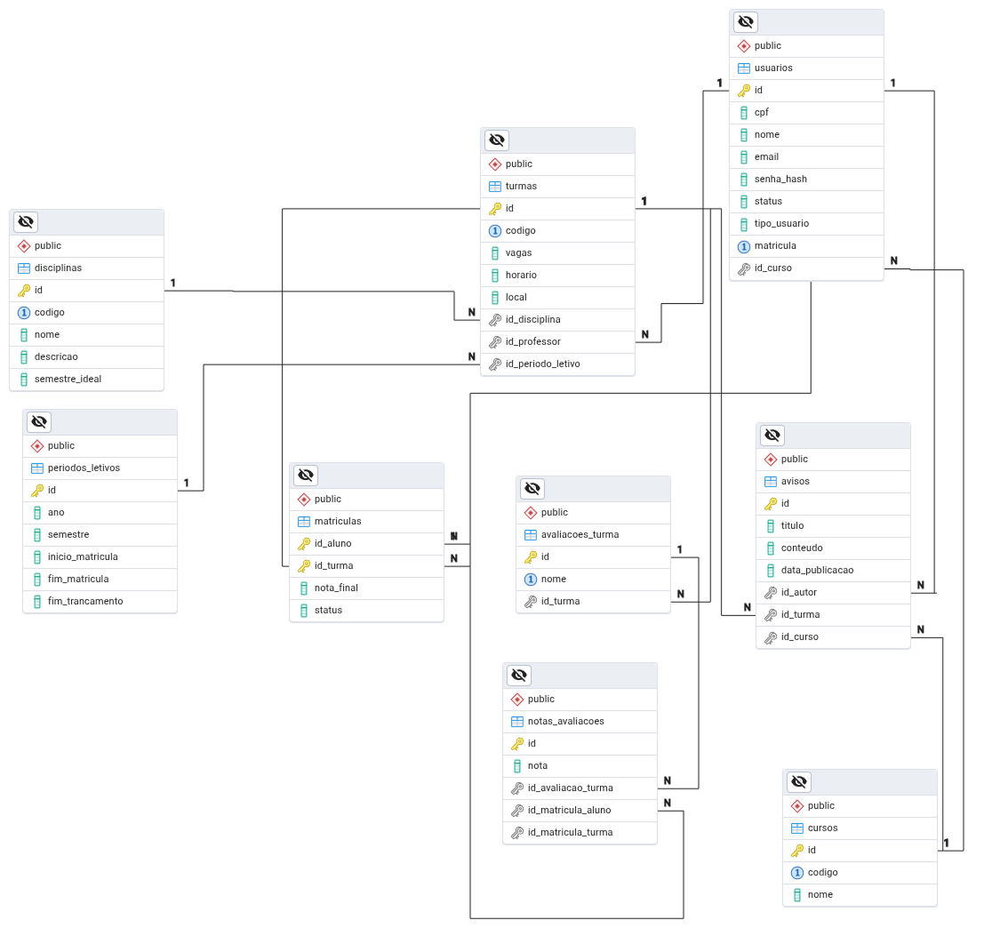

Tanto o Modelo Físico, quanto o DDL foram gerados automaticamente pelo PGAdmin.

## Modelo Físico



## DDL
```sql

BEGIN;


CREATE TABLE IF NOT EXISTS public.avaliacoes_turma
(
    id serial NOT NULL,
    nome character varying(100) COLLATE pg_catalog."default" NOT NULL,
    id_turma integer NOT NULL,
    CONSTRAINT avaliacoes_turma_pkey PRIMARY KEY (id),
    CONSTRAINT _turma_nome_uc UNIQUE (id_turma, nome)
);

CREATE TABLE IF NOT EXISTS public.avisos
(
    id serial NOT NULL,
    titulo character varying(255) COLLATE pg_catalog."default" NOT NULL,
    conteudo text COLLATE pg_catalog."default",
    data_publicacao timestamp with time zone DEFAULT now(),
    id_autor integer NOT NULL,
    id_turma integer,
    id_curso integer,
    CONSTRAINT avisos_pkey PRIMARY KEY (id)
);

CREATE TABLE IF NOT EXISTS public.cursos
(
    id serial NOT NULL,
    codigo character varying(20) COLLATE pg_catalog."default" NOT NULL,
    nome character varying(100) COLLATE pg_catalog."default" NOT NULL,
    CONSTRAINT cursos_pkey PRIMARY KEY (id),
    CONSTRAINT cursos_codigo_key UNIQUE (codigo)
);

CREATE TABLE IF NOT EXISTS public.disciplinas
(
    id serial NOT NULL,
    codigo character varying(20) COLLATE pg_catalog."default" NOT NULL,
    nome character varying(100) COLLATE pg_catalog."default" NOT NULL,
    descricao text COLLATE pg_catalog."default",
    semestre_ideal integer,
    CONSTRAINT disciplinas_pkey PRIMARY KEY (id),
    CONSTRAINT disciplinas_codigo_key UNIQUE (codigo)
);

CREATE TABLE IF NOT EXISTS public.matriculas
(
    id_aluno integer NOT NULL,
    id_turma integer NOT NULL,
    nota_final double precision,
    status statusaprovacaoenum,
    CONSTRAINT matriculas_pkey PRIMARY KEY (id_aluno, id_turma)
);

CREATE TABLE IF NOT EXISTS public.notas_avaliacoes
(
    id serial NOT NULL,
    nota double precision,
    id_avaliacao_turma integer NOT NULL,
    id_matricula_aluno integer NOT NULL,
    id_matricula_turma integer NOT NULL,
    CONSTRAINT notas_avaliacoes_pkey PRIMARY KEY (id),
    CONSTRAINT _aluno_avaliacao_uc UNIQUE (id_avaliacao_turma, id_matricula_aluno)
);

CREATE TABLE IF NOT EXISTS public.periodos_letivos
(
    id serial NOT NULL,
    ano integer NOT NULL,
    semestre integer NOT NULL,
    inicio_matricula date,
    fim_matricula date,
    fim_trancamento date,
    CONSTRAINT periodos_letivos_pkey PRIMARY KEY (id)
);

CREATE TABLE IF NOT EXISTS public.turmas
(
    id serial NOT NULL,
    codigo character varying(20) COLLATE pg_catalog."default" NOT NULL,
    vagas integer NOT NULL,
    horario character varying(100) COLLATE pg_catalog."default",
    local character varying(100) COLLATE pg_catalog."default",
    id_disciplina integer NOT NULL,
    id_professor integer NOT NULL,
    id_periodo_letivo integer NOT NULL,
    CONSTRAINT turmas_pkey PRIMARY KEY (id),
    CONSTRAINT turmas_codigo_key UNIQUE (codigo)
);

CREATE TABLE IF NOT EXISTS public.usuarios
(
    id serial NOT NULL,
    cpf character varying(11) COLLATE pg_catalog."default" NOT NULL,
    nome character varying(100) COLLATE pg_catalog."default" NOT NULL,
    email character varying(100) COLLATE pg_catalog."default",
    senha_hash character varying(255) COLLATE pg_catalog."default" NOT NULL,
    status statuscontaenum,
    tipo_usuario character varying(50) COLLATE pg_catalog."default",
    matricula character varying(20) COLLATE pg_catalog."default",
    id_curso integer,
    CONSTRAINT usuarios_pkey PRIMARY KEY (id),
    CONSTRAINT usuarios_matricula_key UNIQUE (matricula)
);

ALTER TABLE IF EXISTS public.avaliacoes_turma
    ADD CONSTRAINT avaliacoes_turma_id_turma_fkey FOREIGN KEY (id_turma)
    REFERENCES public.turmas (id) MATCH SIMPLE
    ON UPDATE NO ACTION
    ON DELETE NO ACTION;


ALTER TABLE IF EXISTS public.avisos
    ADD CONSTRAINT avisos_id_autor_fkey FOREIGN KEY (id_autor)
    REFERENCES public.usuarios (id) MATCH SIMPLE
    ON UPDATE NO ACTION
    ON DELETE NO ACTION;


ALTER TABLE IF EXISTS public.avisos
    ADD CONSTRAINT avisos_id_curso_fkey FOREIGN KEY (id_curso)
    REFERENCES public.cursos (id) MATCH SIMPLE
    ON UPDATE NO ACTION
    ON DELETE NO ACTION;


ALTER TABLE IF EXISTS public.avisos
    ADD CONSTRAINT avisos_id_turma_fkey FOREIGN KEY (id_turma)
    REFERENCES public.turmas (id) MATCH SIMPLE
    ON UPDATE NO ACTION
    ON DELETE NO ACTION;


ALTER TABLE IF EXISTS public.matriculas
    ADD CONSTRAINT matriculas_id_aluno_fkey FOREIGN KEY (id_aluno)
    REFERENCES public.usuarios (id) MATCH SIMPLE
    ON UPDATE NO ACTION
    ON DELETE NO ACTION;


ALTER TABLE IF EXISTS public.matriculas
    ADD CONSTRAINT matriculas_id_turma_fkey FOREIGN KEY (id_turma)
    REFERENCES public.turmas (id) MATCH SIMPLE
    ON UPDATE NO ACTION
    ON DELETE NO ACTION;


ALTER TABLE IF EXISTS public.notas_avaliacoes
    ADD CONSTRAINT notas_avaliacoes_id_avaliacao_turma_fkey FOREIGN KEY (id_avaliacao_turma)
    REFERENCES public.avaliacoes_turma (id) MATCH SIMPLE
    ON UPDATE NO ACTION
    ON DELETE NO ACTION;


ALTER TABLE IF EXISTS public.notas_avaliacoes
    ADD CONSTRAINT notas_avaliacoes_id_matricula_aluno_id_matricula_turma_fkey FOREIGN KEY (id_matricula_aluno, id_matricula_turma)
    REFERENCES public.matriculas (id_aluno, id_turma) MATCH SIMPLE
    ON UPDATE NO ACTION
    ON DELETE NO ACTION;


ALTER TABLE IF EXISTS public.turmas
    ADD CONSTRAINT turmas_id_disciplina_fkey FOREIGN KEY (id_disciplina)
    REFERENCES public.disciplinas (id) MATCH SIMPLE
    ON UPDATE NO ACTION
    ON DELETE NO ACTION;


ALTER TABLE IF EXISTS public.turmas
    ADD CONSTRAINT turmas_id_professor_fkey FOREIGN KEY (id_professor)
    REFERENCES public.usuarios (id) MATCH SIMPLE
    ON UPDATE NO ACTION
    ON DELETE NO ACTION;


ALTER TABLE IF EXISTS public.turmas
    ADD FOREIGN KEY (id_periodo_letivo)
    REFERENCES public.periodos_letivos (id) MATCH SIMPLE
    ON UPDATE NO ACTION
    ON DELETE NO ACTION
    NOT VALID;


ALTER TABLE IF EXISTS public.usuarios
    ADD CONSTRAINT usuarios_id_curso_fkey FOREIGN KEY (id_curso)
    REFERENCES public.cursos (id) MATCH SIMPLE
    ON UPDATE NO ACTION
    ON DELETE NO ACTION;

END;
```
Para visualizar o arquivo SQL com o DDL: [clique aqui](https://github.com/ProSiga-organization/prosiga-docs/blob/main/docs/ddl.sql)